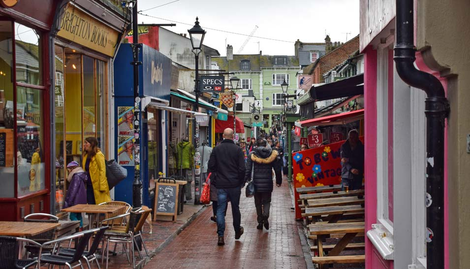

```{r setup, include = FALSE}
# loading libraries
library(tidyverse)


# preset code chunk options
knitr::opts_chunk$set(dpi = 300,            # ensures high resolution images
                      echo = FALSE,         # FALSE: code chunks don't show
                      warning = FALSE,      # FALSE: suppresses warning messages
                      error = FALSE)        # FALSE: Suppresses error messages
```

class: title-slide, center, top, high
background-image: url(img/brighton.jpg)
background-position: bottom
background-size: cover

# `r rmarkdown::metadata$title`


???
Welcome to the University of Brighton
- Rob Hayward


---
class: center, low
# Programmes
--

### MSc Finance & Investment

--

### MSc Finance & Banking

--

### MSc Finance & Risk Management

--

### MSc Finance & Accounting

--

### MSc Economics & Finance

---
class: inverse, center, low
# Semester 1 (October to mid-January)

--

### ECM171 Economics of Financial Markets

--

### FNM191 Finacial Theory and Practice

--

### ECM201 Research Methods in Finance & Economics

---
class: center, top
# Semester 2 (mid-January to mid-June)

--

### Specialist modules that determine the pathway

--

### Econometrics/financial risk management/Investment and Trading

--

### It is possible to do a placement after semester 2

--

### Placement runs from June to June

--

### Valuable work experience

---

class: inverse, center, low
# Dissertation (mid-June to mid-Oct)


---
class: center, low

# RIT


---
class: center, low


background-image: url('https://lebow.drexel.edu/sites/default/files/1422465404-bloomberg.jpg')
background-position: cover

# Bloomberg

---
class: center, inverse, low
# Former students

.pull-left[


### CEO and co-founder evai.io
]
.pull-right[

### Journalist for *Modern Diplomacy* finance and technology centre

]
---
class: centre, low
# Other students

- Fund Administrator
- Epworth Investment Management
- Assistant Vice President Corporate Lending
- ING Bank Turkey
- Pricing Analyst
- General Electric Corporation
- Junior Dealer

---
class: inverse, center, low


# The Lanes Brighton

---

class: inverse, center, low

background-image: url('https://blogs.brighton.ac.uk/studentnewsandevents/files/2020/11/Big_build-new_BusinessSchool_building1500-750x429.jpg')
background-position: cover

# Our new office
---

class: center, middle

# Thanks!

## rh49@brighton.ac.uk

### Questions
Slides created via the R package [**xaringan**](https://github.com/yihui/xaringan).

